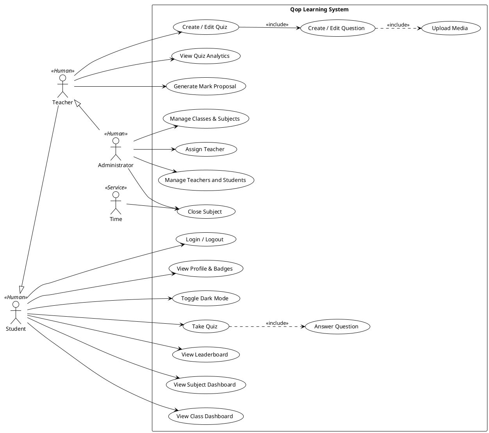

# 02 - Use Case Diagram

This diagram outlines the primary interactions between the system actors and the Qop platform.

```plantuml
@startuml
!theme plain
left to right direction
skinparam packageStyle rectangle

actor "Student" as student << Human >>
actor "Teacher" as teacher << Human >>
actor "Administrator" as admin << Human >>
actor "Time" as time << Service >>

student <|-- teacher
teacher <|-- admin

rectangle "Qop Learning System" {

  ' --- Common / Student Level ---
  usecase "Login / Logout" as UC_Login
  usecase "View Profile & Badges" as UC_Profile
  usecase "Toggle Dark Mode" as UC_Theme
  usecase "Take Quiz" as UC_TakeQuiz
  usecase "Answer Question" as UC_AnswerQuestion
  usecase "View Leaderboard" as UC_ViewLeaderboard
  usecase "View Subject Dashboard" as UC_ViewSubject
  usecase "View Class Dashboard" as UC_ClassStats

  ' --- Teacher Level (Subject Context) ---
  usecase "Create / Edit Quiz" as UC_ManageQuiz
  usecase "Create / Edit Question" as UC_CreateQuestion
  usecase "Upload Media" as UC_UploadMedia
  usecase "View Quiz Analytics" as UC_SubjectStats
  usecase "Generate Mark Proposal" as UC_GenMarks

  ' --- Admin Level ---
  usecase "Manage Teachers and Students" as UC_ManageUsers
  usecase "Manage Classes & Subjects" as UC_ManageClasses
  usecase "Assign Teacher" as UC_AssignLeaders

  ' --- System / Automated ---
  usecase "Close Subject" as UC_CloseSubject
}

' --- Relationships ---

' Student Connections (Base Level)
student --> UC_Login
student --> UC_Profile
student --> UC_Theme
student --> UC_TakeQuiz
student --> UC_ViewLeaderboard
student --> UC_ViewSubject
student --> UC_ClassStats
UC_TakeQuiz ..> UC_AnswerQuestion : << include >>

' Teacher Specific Connections
teacher --> UC_ManageQuiz
teacher --> UC_SubjectStats
teacher --> UC_GenMarks
UC_ManageQuiz --> UC_CreateQuestion : << include >>
UC_CreateQuestion ..> UC_UploadMedia : <<include>>

' Admin Specific Connections
admin --> UC_ManageUsers
admin --> UC_ManageClasses
admin --> UC_AssignLeaders
admin --> UC_CloseSubject

' Time / Automated Connections
time --> UC_CloseSubject

@enduml
```
