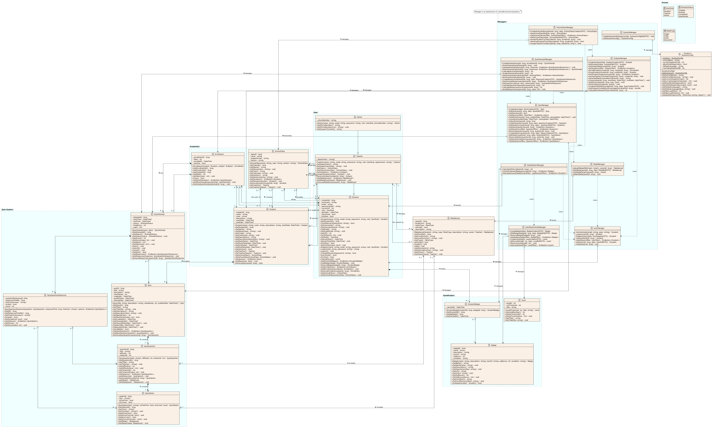

# 04 - Design Class Diagram

This design class diagram outlines a educational system using a layered architecture to separate domain entities from business logic. It provides a detailed specification of data types for all class attributes and method signatures across the system.

It organizes the system into specialized packages for User management, Academics, Quizzes, and Gamification. A key feature is the Manager Layer, where manager class acts as an abstraction of the Controller-Service-Repository pattern.

